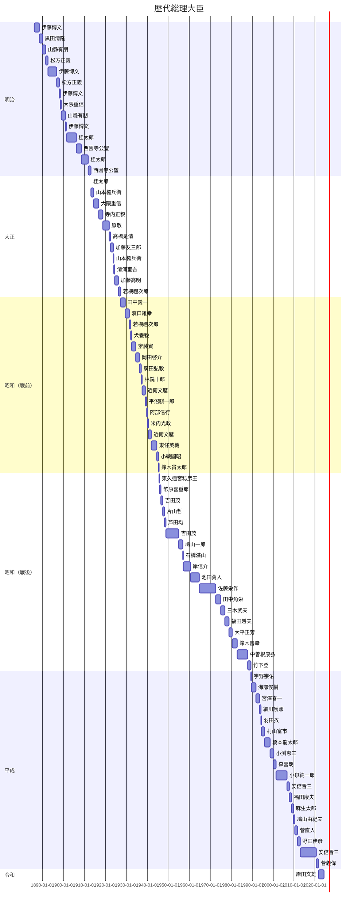

# 歴代総理大臣

```mermaid
gantt
    title 歴代総理大臣
    dateFormat YYYY-MM-DD

section 明治
    伊藤博文 : 1885-12-22, 1888-04-30
    黒田清隆 : 1888-04-30, 1889-10-25
    山縣有朋 : 1889-12-24, 1891-05-06
    松方正義 : 1891-05-06, 1892-08-08
    伊藤博文 : 1892-08-08, 1896-08-31
    松方正義 : 1896-09-18, 1898-01-12
    伊藤博文 : 1898-01-12, 1898-06-30
    大隈重信 : 1898-06-30, 1898-11-08
    山縣有朋 : 1898-11-08, 1900-10-19
    伊藤博文 : 1900-10-19, 1901-05-10
    桂太郎 : 1901-06-02, 1906-01-07
    西園寺公望 : 1906-01-07, 1908-07-14
    桂太郎 : 1908-07-14, 1911-08-30
    西園寺公望 : 1911-08-30, 1912-12-21

section 大正
    桂太郎 : 1912-12-21, 1913-02-20
    山本権兵衛 : 1913-02-20, 1914-04-16
    大隈重信 : 1914-04-16, 1916-10-09
    寺内正毅 : 1916-10-09, 1918-09-29
    原敬 : 1918-09-29, 1921-11-04
    高橋是清 : 1921-11-13, 1922-06-02
    加藤友三郎 : 1922-06-12, 1923-08-24
    山本権兵衛 : 1923-09-02, 1924-01-07
    清浦奎吾 : 1924-01-07, 1924-06-11
    加藤高明 : 1924-06-11, 1926-01-28
    若槻禮次郎 : 1926-01-30, 1927-04-20

section 昭和（戦前）
    田中義一 : 1927-04-20, 1929-07-02
    濱口雄幸 : 1929-07-02, 1931-04-14
    若槻禮次郎 : 1931-04-14, 1931-12-13
    犬養毅 : 1931-12-13, 1932-05-16
    齋藤實 : 1932-05-26, 1934-07-08
    岡田啓介 : 1934-07-08, 1936-03-09
    廣田弘毅 : 1936-03-09, 1937-02-02
    林銑十郎 : 1937-02-02, 1937-06-04
    近衛文麿 : 1937-06-04, 1939-01-05
    平沼騏一郎 : 1939-01-05, 1939-08-30
    阿部信行 : 1939-08-30, 1940-01-16
    米内光政 : 1940-01-16, 1940-07-22
    近衛文麿 : 1940-07-22, 1941-10-18
    東條英機 : 1941-10-18, 1944-07-22
    小磯國昭 : 1944-07-22, 1945-04-07
    鈴木貫太郎 : 1945-04-07, 1945-08-17

section 昭和（戦後）
    東久邇宮稔彦王 : 1945-08-17, 1945-10-09
    幣原喜重郎 : 1945-10-09, 1946-05-22
    吉田茂 : 1946-05-22, 1947-05-24
    片山哲 : 1947-05-24, 1948-03-10
    芦田均 : 1948-03-10, 1948-10-15
    吉田茂 : 1948-10-15, 1954-12-10
    鳩山一郎 : 1954-12-10, 1956-12-23
    石橋湛山 : 1956-12-23, 1957-02-25
    岸信介 : 1957-02-25, 1960-07-19
    池田勇人 : 1960-07-19, 1964-11-09
    佐藤栄作 : 1964-11-09, 1972-07-07
    田中角栄 : 1972-07-07, 1974-12-09
    三木武夫 : 1974-12-09, 1976-12-24
    福田赳夫 : 1976-12-24, 1978-12-07
    大平正芳 : 1978-12-07, 1980-06-12
    鈴木善幸 : 1980-07-17, 1982-11-27
    中曽根康弘 : 1982-11-27, 1987-11-06
    竹下登 : 1987-11-06, 1989-06-03

section 平成
    宇野宗佑 : 1989-06-03, 1989-08-10
    海部俊樹 : 1989-08-10, 1991-11-05
    宮澤喜一 : 1991-11-05, 1993-08-09
    細川護煕 : 1993-08-09, 1994-04-28
    羽田孜 : 1994-04-28, 1994-06-30
    村山富市 : 1994-06-30, 1996-01-11
    橋本龍太郎 : 1996-01-11, 1998-07-30
    小渕恵三 : 1998-07-30, 2000-04-05
    森喜朗 : 2000-04-05, 2001-04-26
    小泉純一郎 : 2001-04-26, 2006-09-26
    安倍晋三 : 2006-09-26, 2007-09-26
    福田康夫 : 2007-09-26, 2008-09-24
    麻生太郎 : 2008-09-24, 2009-09-16
    鳩山由紀夫 : 2009-09-16, 2010-06-08
    菅直人 : 2010-06-08, 2011-09-02
    野田佳彦 : 2011-09-02, 2012-12-26
    安倍晋三 : 2012-12-26, 2020-09-16
    菅義偉 : 2020-09-16, 2021-10-04

section 令和
    岸田文雄 : 2021-10-04, 2024-04-30

```